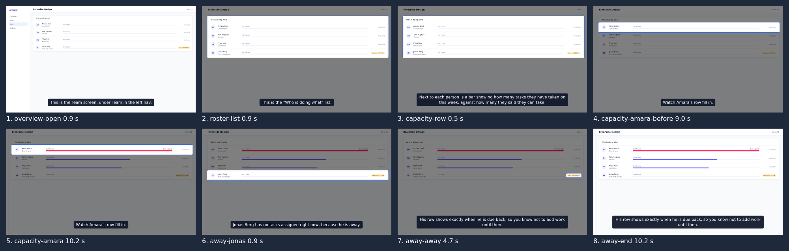

# Unattended run: the Team screen

ROADMAP v0.1 item 5 asks for Claude Code, given only the skill, to make a tour of a second example
screen that passes `verify`, unattended, with the transcript kept. This is that run.

## Setup

- **Screen:** `examples/next-app/app/team/page.tsx`, a "Who is doing what" list with a capacity bar
  per person, an over-capacity flag and an away date. The screen was added for this run and had
  no stage, fixture or walkthrough before it.
- **Agent:** Claude Code 2.1.282 in print mode (`claude -p`), model claude-sonnet-5, started in
  `examples/next-app` of a clean copy of the repo. Allowed tools: Bash, Edit, Write, Read, Glob,
  Grep and Skill. No other instructions and no CLAUDE.md about Tourwright, so all it knew came
  from the `walkthrough` skill and the code.
- **Prompt:** [prompt.txt](prompt.txt), in full. It names the screen and the audience, says to use
  the skill, and adds two things the run needed:
  - "Work unattended": the skill has the agent get the storyboard approved before writing beats,
    and nobody is there to approve it, so the prompt says to pick a default and report it instead.
  - `--fake-voice`: the machine it ran on cannot reach huggingface.co, so narration is silent with
    realistic timing. Every other step is the real one.

## Result

It passed. After 33 turns, 229 s and $0.75, `verify` reported 0 errors and 0 warnings, and `make`
wrote a 53.1 s MP4. Running `npx tourwright verify team` again afterwards gave the same result.

What it did, in order: loaded the skill, read the stage, fixtures, components and data, added a
`team` fixture and stage, checked the stage with `inspect`, drafted the script with
`new --from-stage`, then ran `check --fix` and `verify --fix`. It then read the stills, moved the zoom
onto Amara's row to the cue where her name is spoken, rather than a sentence earlier, verified again and made the
video.

Its four scenes are the overview, the roster, capacity (Amara's bar fills and turns red) and away
status (Jonas). The defaults it picked and reported are at the end of the
[transcript](transcript.md).

What a reviewer would still send back: the roster scene shows every bar at "0 of N tasks",
because the `load` value animates all rows from zero and only Amara's scene plays it. That is a
fixture choice, not something `verify` can see, which is why Muse review stays in the loop. By the skill's own rule the video is not finished
until someone approves it there, and nobody has yet.

## Files

- [prompt.txt](prompt.txt): the prompt, verbatim.
- [transcript.md](transcript.md): every message, tool call and tool result from the run (long results cut).
- [timing.md](timing.md): the timing report from its last `verify`.
- The agent's changes, as it made them: `examples/next-app/tourwright/fixtures.ts`,
  `examples/next-app/tourwright/stages.tsx` and
  `examples/next-app/tourwright/walkthroughs/team/script.json`.
